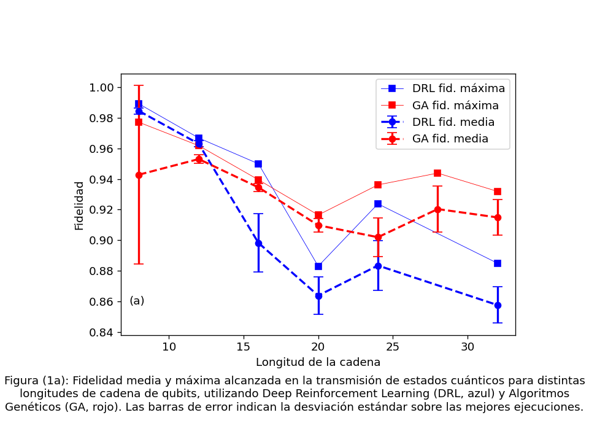
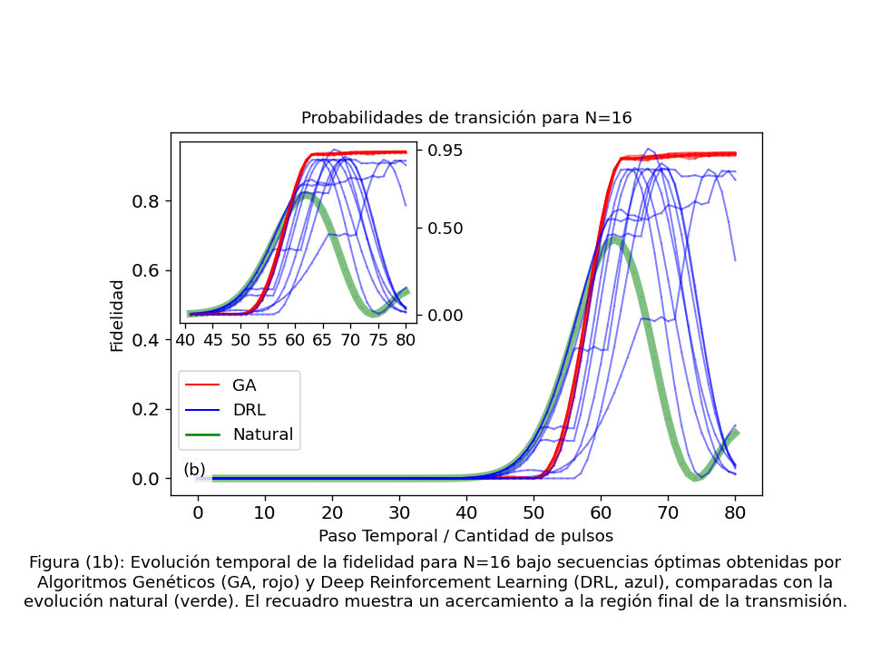
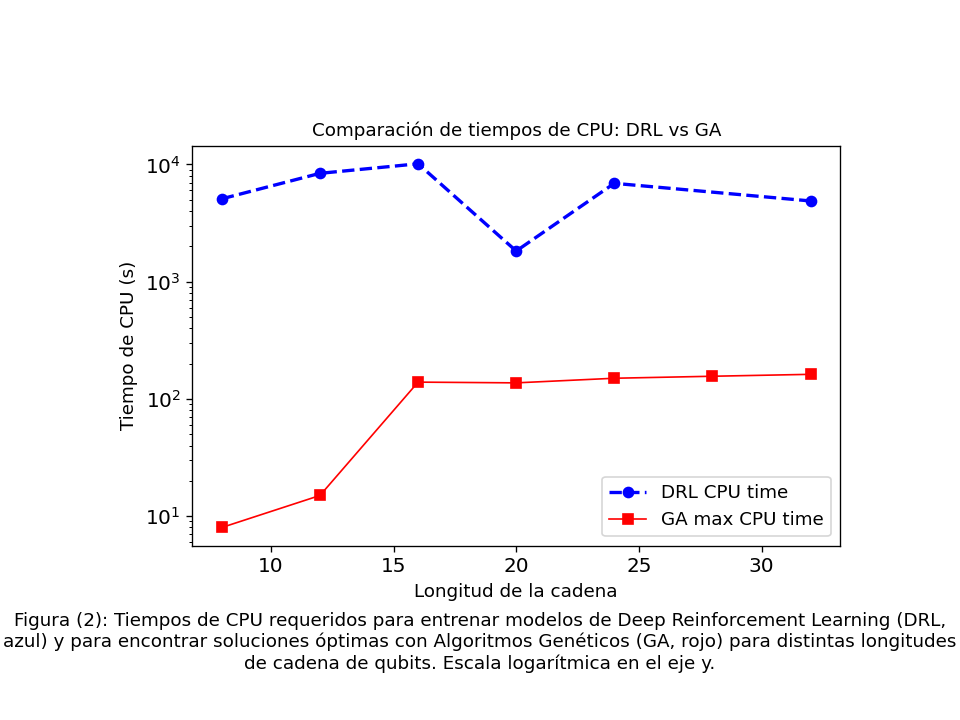
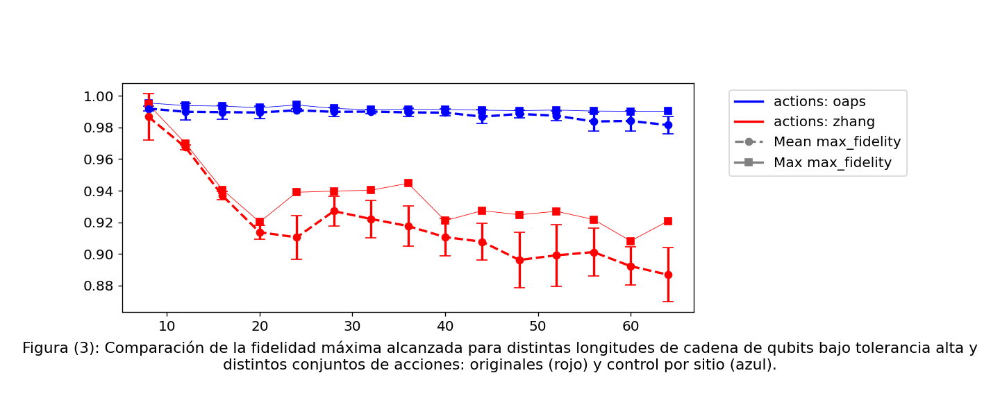

#### 54 Jornadas Argentinas de Informática e investigación Operativa

# Optimización de la Transmisión de Estados Cuánticos en Cadenas de Qubits usando Deep Reinforcement Learning y Algoritmos Genéticos

Sofía Perón Santana

--- 

Este repositorio resume los resultados y gráficos presentados en el artículo *Optimización de la Transmisión de Estados Cuánticos en Cadenas de Qubits usando Deep Reinforcement Learning y Algoritmos Genéticos* presentado en la 54 JAIIO. En el mismo se comparan los dos enfoques mencionados y se cuantifica su desempeño para la optimización de transmisiones de estados cuánticos en cadenas de qubits. 

### Algoritmos genéticos vs DRL

El primer gráfico presentado muestra las fidelidades máximas y medias logradas con ambos métodos para distintos largos de cadenas de qubits. Los directorios con los resultados crudos se incluyen en este repositorio en sus respectivos directorios `drl_preliminary_results` y `ga_preliminary_results` y los códigos necesarios para generarlos pueden encontrarse [aquí](https://github.com/sofips/dynamic_control_for_QST/blob/JAIIO_material_suplementario/JAIIO_graphs.ipynb).

### Extracción de datos de fidelidad 

#### Para DRL:

Cada directorio contiene los resultados del entrenamiento para una longitud de cadena específica.  
Se recuperan los 10 valores más altos de fidelidad obtenidos durante el entrenamiento para cada longitud de cadena.

#### Para GA: 

Se realizaron pruebas para distintas longitudes dentro del directorio principal, se encuentran los directorios de las distintas pruebas (con distintos parámetros de algoritmo). A su vez, dentro de cada uno de ellos se halla un archivo de resumen del que extraemos las fidelidades máximas obtenidas y los directorios con las secuencias de acciones para cada longitud de cadena.

## Comparación de soluciones obtenidas

A continuación, se muestran las probabilidades de transición asociadas a las secuencias obtenidas por cada uno de los métodos. Los resultados observados son para una cadena de 16 qubits.

## Tiempos de CPU

Es interesante destacar también que el algoritmo genético presenta una gran ventaja respecto a la eficiencia computacional. El siguiente gráfico muestra el tiempo que requiere entrenar un modelo de DRL y el tiempo que requiere una corrida de algoritmo genético. Dado que en RL no se pudo hacer estadística sobre los tiempos de entrenamiento ya que requeriría entrenar repetidas veces y son tiempos largos, comparamos con el valor máximo de tiempo de búsqueda en el genético. 

Es posible que los tiempos de ejecución en DRL puedan acortarse mediante optimizaciones. Sin embargo, dada la naturaleza de implementación del algoritmo genético, este es fácilmente paralelizable en GPU lo que permite reducir ampliamente los tiempos de cómputo.

## Extensión a más dimensiones y alta tolerancia

Al presentar tiempos de cómputo menores, es posible extender los resultados a mayores dimensiones. Para el siguiente gráfico, se fijó la tolerancia $\zeta$ = 0.01, para verificar si era posible mejorar aún más los resultados. Se observa que para dimensiones altas el método comienza a fallar, para eso incorporamos un nuevo conjunto de acciones que aplica control en cada sitio y permite obtener fidelidades cercanas a 0.99 para cadenas de hasta 64 qubits.

