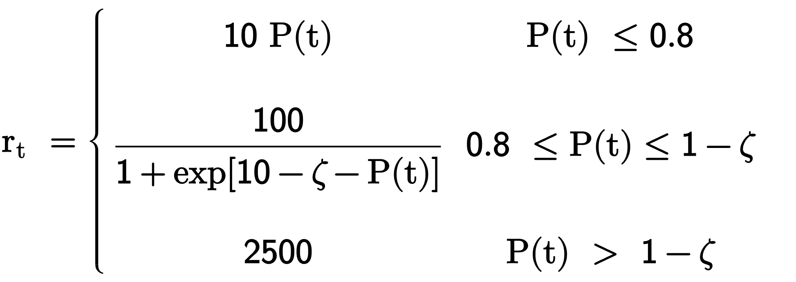

# Detalles de implementación para el algoritmo de DRL 

<table>
<tr><th> Parámetros de aprendizaje </th><th> Parámetros del sistema</th></tr>
<tr><td>

| Parámetro                        | Valor    |
|:----------------------------------------|:---------|
| Tamaño del minibatch                    | 32       |
| Tamaño de la memoria                    | 40000    |
| Leraning rate  ($\alpha$)               | 0.01     |
| Discount factor ($\gamma$)             | 0.95     |
| $N^\circ$ de capas ocultas              | 2        |
| Neuronas por capa oculta                | 120      |
| Epsilon inicial/final ($\epsilon$)      | 1/0.01   |
| Decaimiento                             | 0.0001   |
| Frecuencia de aprendizaje               | 5        |

</td><td>

| Parámetros                            | Valor    |
|:----------------------------------------|:---------|
| Largo de cadena (N)                     | variable |
| Paso temporal ($dt$)                    | 0.15     |
| Tiempo máximo ($\tau$)                  | $5N \times dt$|
| Int. de acoplamientos ($J$)             | 1        |
| Campo externo ($B$)                     | 100      |
| Tolerancia (1-P) ($\zeta$)              | 0.05     |

</td></tr> </table>

Estos fueron los parámetros utilizados por defecto en todos los experimentos excepto en aquellos en los que se especifique alguna variación. El programa guarda automáticamente una tarjeta de configuración con los parámetros que usó al ejecutarse que queda almacenada en el mismo directorio que los resultados. 

### Función recompensa utilizada

La función recompensa $r_t$ utilizada fue tomada del trabajo de referencia (Zhang, 2018) y está basada en la fidelidad o probabilidad de transmisión $P(t)$ definida en la ec (6) del texto: "*Optimización de la Transmisión de Estados Cuánticos en Cadenas de Qubits usando Deep Reinforcement Learning y Algoritmos Genéticos*" y de la tolerancia o threshold de la misma $\zeta$:

