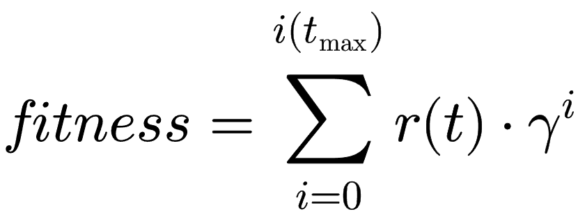
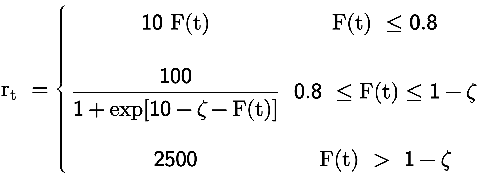

# Detalles de implementación para el algoritmo genético

<table>
<tr><th> Parámetros de aprendizaje </th><th> Parámetros del sistema</th></tr>
<tr><td>

| Parámetro                              | Valor                    |
|----------------------------------------|---------------------------|
| Individuos en población                | 3000                      |
| Selección de padres                    |300 (10%) usando 'sss'          |
| Elitismo                               | 300   (10%)                   |
| Crossover                              | Uniforme (probabilidad = 0.8)              |
| Mutación                               | swap sobre N genes       |
| Saturación                             | 20                       |

</td><td>

| Parámetro                              | Valor                 |
|----------------------------------------|------------------------|
| Paso temporal ($dt$)                   | 0.15                  |
| Acoplamientos ($J$)                    | 1                     |
| Campo externo ($B$)                    | 100                   |
| Número de genes                        | 5N ($t \simeq 1.5N$)  |
| Tolerancia (1-F) ($\zeta$)             | 0.01                  |

</td></tr> </table>

Estos fueron los parámetros utilizados por defecto en todos los experimentos excepto en aquellos en los que se especifique alguna variación. El programa guarda automáticamente una tarjeta de configuración con los parámetros que usó al ejecutarse que queda almacenada en el mismo directorio que los resultados. 

## Función fitness

La función fitness utilizada se inspira en el algoritmo de DRL pero lo implementa simultáneamente sobre todo el conjunto de 

donde

